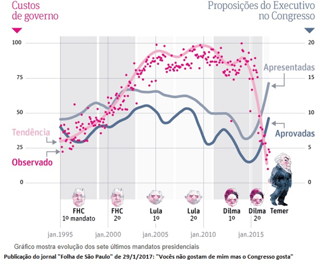
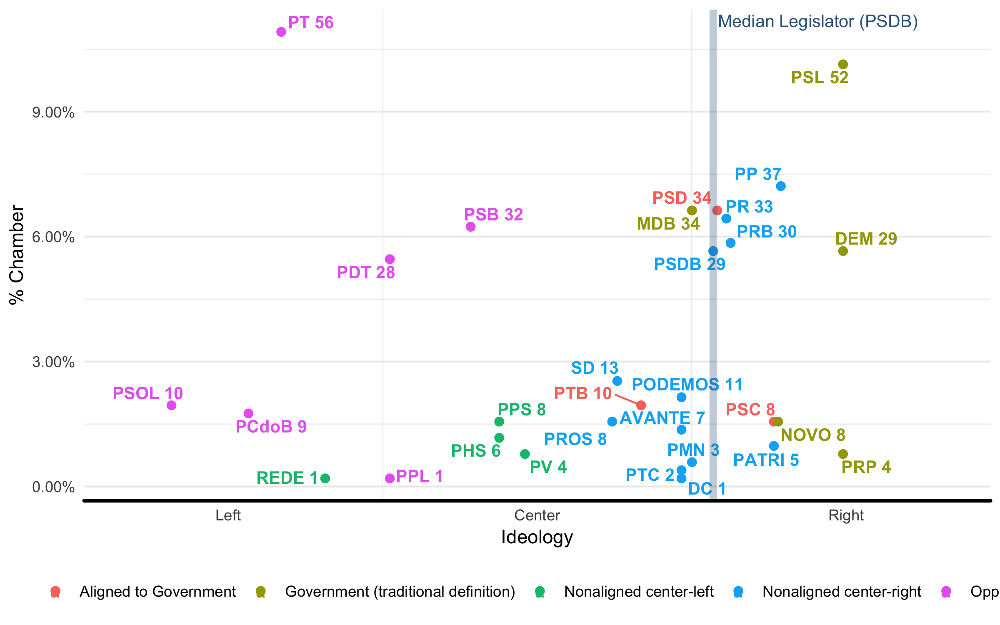
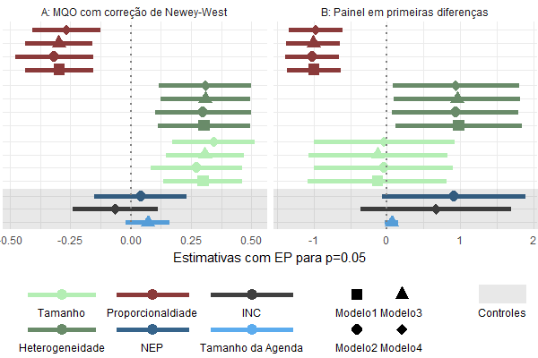
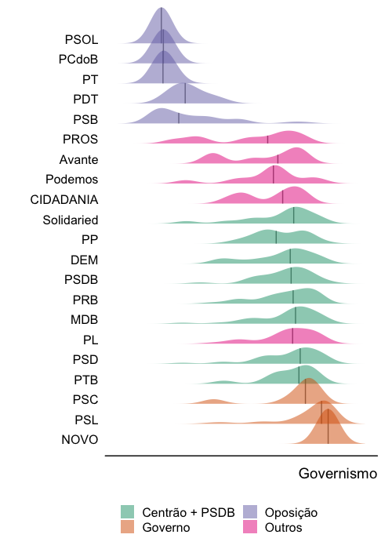

```{r setup, include=FALSE}
knitr::opts_chunk$set(echo = T, eval=F)
```

# O que é o dataset?

## Motivações e origens 

- Custos de Governabilidade (CNPq/FGV)

- Custos e Eficiência da Governabilidade em Presidencialismo Multipartidário: Uma Análise da Alocação de Cargos de Livre Nomeação na Burocracia Federal (IPEA)

- Tese de Doutorado: gerência de coalizão

# O que há no dataset?

## Características gerais

- 630 variáveis (até agora, mas calma)

- Cobertura: jan/88 (jan/1995) - dez/2018 (out/2019) = 288, 373 e 383 meses

- Cada linha mês/ano (por isso tanta variável)

## Dados secundários

- SIGA Brasil (execução orçamentária)

- Zucco & Power (ideologia dos partidos)

- BD CEBRAP (congresso)

## Variáveis por grupo {.smaller}

- Ocupação política de ministérios 

- Participação partidária na coalizão

- Ideologia na ocupação ministerial

- Despesas dos ministérios (execução)

- Alocação partidária das despesas

- Alocação de emendas orçamentárias aos partidos

- Ocupação de cargos na burocracia (DAS 4, 5 e 6) - Sérgio Praça e Felix Lopez

- Partidos na câmara (assentos, coalizão, apoio ao executivo)

- Características da coalizão (índices e medidas de ideologia)

- Variáveis de contexto (popularidade, GINI, PIB)

# O que já foi feito com o dataset?

## Papers {.smaller}

- Publicados

PEREIRA, Carlos ; BERTHOLINI, Frederico . Coalition Management in Multiparty Presidential Regimes. In: Barry Ames. (Org.). *Routledge Handbook of Brazilian Politics.* 1ed.Abingdon: v. 1, p. 313-330. Routledge, 2018

HIROI, Taeko; RENNÓ, Lucio *Disentangling legislative duration in coalitional presidential systems.* The Journal of Legislative Studies 24, no. 4: 475-498, 2018

BERTHOLINI, Frederico; PEREIRA, Carlos . P*agando o preço de governar: custos de gerência de coalizão no presidencialismo brasileiro.* RAP. Revista Brasileira de Administração Pública, v. 51, p. 528-550, 2017.

## Papers 2 {.smaller}

- Publicados

PEREIRA, Carlos; BATISTA, Mariana; PRAÇA, Sérgio; LOPEZ, Felix. *Watchdogs in Our Midst: How Presidents Monitor Coalitions in Brazil's Multiparty Presidential Regime.* Latin American Politics and Society 59, no. 3: 27-47, 2017

PEREIRA, Carlos ; BERTHOLINI, Frederico ; RAILE, ERIC D. . *All the President's Men and Women: Coalition Management Strategies and Governing Costs in a Multiparty Presidency.* Presidential Studies Quarterly, v. 43, p. 550-568, 2016.

- Working papers

Pereira, Carlos, Marcus André BC de Melo, and Frederico Bertholini. *Coalition management under divided/unified government.* 


## ICG {.centered}



## Mapa espacial {.centered}


```{r, eval=T, echo=F, out.width = "100%"}

```


## Estimações {.centered .smaller}



## Comportamento dos partidos (API) {.centered .smaller}


```{r, eval=T, echo=F, out.width = "50%"}

```

## Outros

http://fredbsr.github.io/brazil_coalitions

https://public.tableau.com/views/CoalitionManagement/Story1?:embed=y&:display_count=yes&:origin=viz_share_link

https://public.tableau.com/views/CoalitionManagement/Story1?:embed=y&:display_count=yes&:origin=viz_share_link


# Como usar o dataset?

## Baixando dados do dataverse {.smaller}

https://dataverse.harvard.edu/dataset.xhtml?persistentId=doi:10.7910/DVN/9EJGE9

Lendo no R:

- Wide (mês/ano)
```{r}
# Reading wide data from dataverse
data <- dataverse::get_file("dataset_coalmngm_brazil_v8.xlsx",
                            "doi:10.7910/DVN/9EJGE9")
df_wide <- tempfile(fileext = ".xlsx")
writeBin(as.vector(data), df_wide)
df_wide <- readxl::read_xlsx(df_wide,col_names = TRUE, skip = 6) 
```

- Long (partido/mês/ano)
```{r }
# Reading long data from dataverse
data <- dataverse::get_file("parties_brazil_long.RDS", 
                            "doi:10.7910/DVN/9EJGE9")
df_long <- tempfile(fileext = ".RDS")
writeBin(as.vector(data), df_long)
df_long <- readRDS(df_long) 
```


# O que podemos fazer? <br> (não só com o dataset)

## Caminhos

- Manutenção dos dados e substituição de fontes secundárias (API Câmara)
- Pacote?
- E o Senado?
- Ampliação para outros países (mesma granularidade?)
- Integração com outros conjuntos de dados


